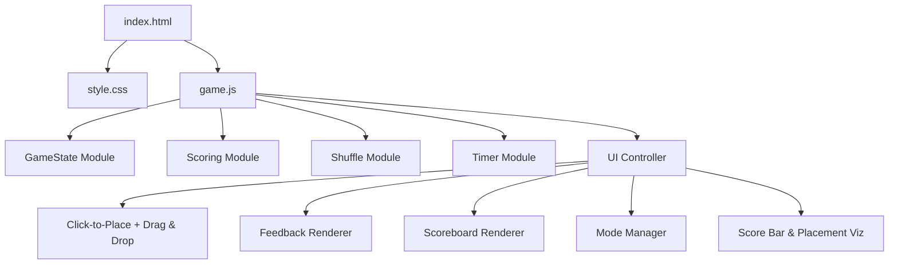

# Design Document: AlphaBlet Game

## Overview

AlphaBlet is a single-player browser-based alphabet placement game. The player places randomized letters into their correct slot among 26 blank slots arranged in two rows of 13 (A–M, N–Z). The game supports click/tap-to-place on all devices and drag-and-drop on desktop. It tracks time and accuracy per round, producing a composite score (`time + distance² × 8`, adjusted by a per-round mode multiplier). Three difficulty modes control visual feedback. The entire application runs client-side with no dependencies.

## Architecture



### File Structure

```
/
├── index.html          # Game layout (3-column header grid + 2-row slot grid)
├── style.css           # All styling, animations, responsive
├── game.js             # All game logic and UI control
├── game.test.js        # Property-based tests (fast-check)
├── game.ui.test.js     # UI integration tests (jsdom)
├── package.json        # Dev dependencies (vitest, fast-check, jsdom)
└── README.md           # Documentation
```

## Layout

### Header Grid (3 columns × 3 rows)

| | Col 1 (auto) | Col 2 (1fr) | Col 3 (auto) |
|---|---|---|---|
| Row 1 | New Game button | Title "Alphablet" | Letter display |
| Row 2 | (spans from row 1) | Time / Score | (spans from row 1) |
| Row 3 | (spans from row 1) | Mode slider | (spans from row 1) |

New Game button and letter display each span all 3 rows. Center column items are centered. Time and score use `space-around` distribution with fixed-width fields (min-width 5.5em, tabular-nums, right-aligned).

### Slot Grid

Always two rows of 13: `grid-template-columns: repeat(13, 1fr)`. Slots have `aspect-ratio: 2/3` (taller than wide). Blank, unlabeled.

## Components and Interfaces

### Pure Functions (testable)

```javascript
function generateShuffle() { }                                    // Fisher-Yates → string[26]
function calculateDistance(correctIndex, placedIndex) { }          // |correct - placed|, clamped 0-25
function calculateScore(elapsedHundredths, distance) { }           // time + distance² × 8
function calculateCumulativeScore(roundScores) { }                 // sum of array
function getFeedbackColor(distance) { }                            // 0→green, 1-12→yellow-to-red, ≥13→red
function formatTime(hundredths) { }                                // e.g., 1234 → "12.34"
function createGameState() { }                                     // fresh state
function advanceRound(state, slotIndex, elapsedHundredths, mode) { } // immutable update
function getCurrentLetter(state) { }                               // shuffle[currentRound] or null
function isGameComplete(state) { }                                 // currentRound >= 26
```

### UI Controller

- Idle state on load; New Game to start
- `placeLetter(slotIndex, clickedSlot)` — shared by click and drag, stops timer, advances state, applies feedback + click-pop + scoreboard update
- Click handling via event delegation on slot bar (registered once)
- Drag-and-drop only on non-touch devices; single-slot highlight; nearest-slot fallback
- Real-time scoreboard color via timer tick
- Game-over: two-row placement viz with animated fade-in + score bar

## Data Models

### GameState

```javascript
{
  shuffle: string[],          // Permutation of 26 letters
  currentRound: number,       // 0-25, 26 = complete
  roundScores: number[],      // Raw scores per round
  roundTimes: number[],       // Elapsed hundredths per round
  roundDistances: number[],   // Distances per round
  roundPlacedSlots: number[], // Slot index where each letter was placed
  roundModes: number[],       // Mode (0/1/2) at time of each placement
  cumulativeScore: number,    // Sum of raw round scores
}
```

### Constants

```javascript
const ALPHABET = 'ABCDEFGHIJKLMNOPQRSTUVWXYZ'.split('');
const TOTAL_ROUNDS = 26;
const MAX_DISTANCE_FOR_COLOR = 13;
const HIGHLIGHT_DURATION_MS = 1000;
const TIMER_INTERVAL_MS = 10;
const MODE_MULTIPLIERS = [1.0, 0.8, 0.6];
const SCORE_TIERS = [
  { label: 'E-Lite', min: 0, max: 2000, color: '#00c853' },
  { label: 'T-Rific', min: 2000, max: 4000, color: '#66bb6a' },
  { label: 'D-Cent', min: 4000, max: 6000, color: '#ffa726' },
  { label: 'F-Ort', min: 6000, max: 8000, color: '#ef5350' },
];
```

### Scoring

```
raw_score = elapsed_time_hundredths + distance² × 8
displayed_score = Σ(raw_score[i] × MODE_MULTIPLIERS[mode[i]])
tier_scale = 0.8 / effective_mode_multiplier
```

## Difficulty Modes

| Mode | Slider | Visual Feedback | Multiplier |
|------|--------|----------------|------------|
| A Ok | Left (0) | Letters shown in correct slots | 1.0× |
| B Careful | Center (1, default) | Correct slots glow light blue | 0.8× |
| C of Trouble | Right (2) | Nothing persists after flash | 0.6× |

Mode locked in per placement. Mid-game changes update visual state only.

## Game-Over Visualization

### Placement Viz (two-row, animated)
- Top viz (slots 0–12): letters above, lines below (connecting to top row of slots)
- Bottom viz (slots 13–25): lines above, letters below (connecting to bottom row of slots)
- Animation: slot bar gets `viz-active` class (margin transition 300ms), then viz containers fade in (opacity 0→1, 400ms)
- Line height proportional to placement time, normalized to slowest letter (max 120px)
- Colors match feedback color for each round's distance

### Score Bar
- Four colored segments (E-Lite, T-Rific, D-Cent, F-Ort)
- White marker at player's score position; label shifts left when >85% to prevent overflow
- Tier name displayed below
- Boundaries scale by `0.8 / effective_mode_multiplier`

## Visual Feedback

- **Placement flash**: correct slot gets feedback color (green/yellow/red) for 1 second via inline style + setTimeout removal
- **Click pop**: clicked slot scales to 1.4× for 500ms via CSS class toggle (`transform: scale(1.4)`, no layout reflow)
- **Drag-over**: single-slot highlight (all others cleared on each dragover); all cleared on drop/dragend
- **Score color**: scoreboard text color updates every 10ms based on projected final tier

## Correctness Properties

1. Shuffle permutation: sorted = [A..Z], length 26, no duplicates
2. Letter order: getCurrentLetter at round N = shuffle[N]
3. Score formula: score = elapsed + distance² × 8
4. Score monotonicity: d1 ≤ d2 → score(d1) ≤ score(d2)
5. Score lower bound: score ≥ elapsed
6. Cumulative sum: cumulative = Σ round scores
7. Color interpolation: 0→green, 1-12→yellow-to-red, ≥13→red
8. Time format round-trip: parse(format(n)) = n
9. Drop advances round: round N → round N+1
10. Invalid drop preserves state: no change without advanceRound
11. New game resets: cumulativeScore=0, currentRound=0

## Testing

- **game.test.js**: 14 property-based tests (fast-check, 100+ iterations each)
- **game.ui.test.js**: 8 UI integration tests (vitest + jsdom): idle state, slot rendering, letter display, game-over viz + score bar, new game reset, click-to-place
