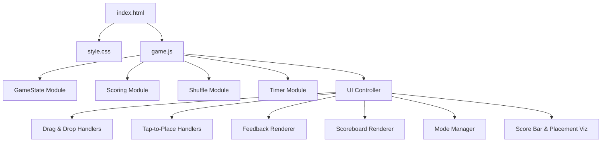

# Design Document: AlphaBlet Game

## Overview

AlphaBlet is a single-player browser-based alphabet placement game implemented as a static HTML/CSS/JS application. The player places randomized letters into their correct alphabetical slot among 26 blank slots. The game supports drag-and-drop (desktop) and tap-to-place (mobile). It tracks time and accuracy per round, producing a composite score (`time + distance² × 8`, adjusted by a per-round mode multiplier). Three difficulty modes control visual feedback. The entire application runs client-side with no dependencies, suitable for GitHub Pages deployment.

## Architecture



### File Structure

```
/
├── index.html          # Single HTML page with game layout
├── style.css           # All styling including animations and mobile responsive
├── game.js             # All game logic and UI control
├── game.test.js        # Property-based tests (fast-check)
├── game.ui.test.js     # UI integration tests (jsdom)
├── package.json        # Dev dependencies (vitest, fast-check, jsdom)
└── README.md           # Documentation
```

### Design Decision: Single JS File

All JavaScript lives in one `game.js` file. Rationale:
- No build step required (static deployment constraint)
- No module bundler needed
- Internal module pattern provides logical separation
- CommonJS exports at the bottom for Node.js test compatibility

## Components and Interfaces

### 1. Shuffle Module

```javascript
function generateShuffle() { }  // Fisher-Yates → string[26]
```

### 2. Scoring Module

```javascript
function calculateDistance(correctIndex, placedIndex) { }  // |correct - placed|, clamped 0-25
function calculateScore(elapsedHundredths, distance) { }   // time + distance² × 8
function calculateCumulativeScore(roundScores) { }          // sum of array
```

### 3. Feedback Module

```javascript
function getFeedbackColor(distance) { }  // 0→green, 1-12→yellow-to-red interpolation, ≥13→red
```

### 4. Timer Module

```javascript
function formatTime(hundredths) { }  // e.g., 1234 → "12.34"
```

### 5. GameState Module

```javascript
function createGameState() { }                                    // fresh state
function advanceRound(state, slotIndex, elapsedHundredths, mode) { }  // immutable update
function getCurrentLetter(state) { }                              // shuffle[currentRound] or null
function isGameComplete(state) { }                                // currentRound >= 26
```

### 6. UI Controller

Orchestrates DOM updates and event handling:
- Idle state on page load (no letter, not interactive until New Game clicked)
- Mode slider with three positions (A Ok / B Careful / C of Trouble)
- Dual interaction: drag-and-drop (desktop) + tap-to-select/tap-to-place (mobile)
- Drag-over highlight cleanup (only one slot highlights at a time)
- Per-round timer (resets each round) with cumulative total time display
- Real-time scoreboard color based on projected tier
- Placement visualization and score bar on game completion with fade-in animation
- Mobile: two-row viz (above/below slots) with animated slot spacing

## Data Models

### GameState

```javascript
{
  shuffle: string[],          // Permutation of 26 letters
  currentRound: number,       // 0-25, 26 = complete
  roundScores: number[],      // Raw scores per round
  roundTimes: number[],       // Elapsed hundredths per round
  roundDistances: number[],   // Distances per round
  roundPlacedSlots: number[], // Slot index where each letter was placed
  roundModes: number[],       // Mode (0/1/2) at time of each placement
  cumulativeScore: number,    // Sum of raw round scores
}
```

### Constants

```javascript
const ALPHABET = 'ABCDEFGHIJKLMNOPQRSTUVWXYZ'.split('');
const TOTAL_ROUNDS = 26;
const MAX_DISTANCE_FOR_COLOR = 13;
const HIGHLIGHT_DURATION_MS = 1000;
const TIMER_INTERVAL_MS = 10;
const MODE_MULTIPLIERS = [1.0, 0.8, 0.6];  // A Ok, B Careful, C of Trouble
const SCORE_TIERS = [
  { label: 'E-Lite', min: 0, max: 2000, color: '#00c853' },
  { label: 'T-Rific', min: 2000, max: 4000, color: '#66bb6a' },
  { label: 'D-Cent', min: 4000, max: 6000, color: '#ffa726' },
  { label: 'F-Ort', min: 6000, max: 8000, color: '#ef5350' },
];
```

### Scoring Formula

```
raw_score = elapsed_time_hundredths + distance² × 8
displayed_score = Σ(raw_score[i] × MODE_MULTIPLIERS[mode[i]])
```

The additive formula ensures speed cannot cancel out inaccuracy. The distance² term makes large errors quadratically expensive.

### Tier Boundary Scaling

Tier boundaries are calibrated for B Careful (0.8×) and scale by `0.8 / effective_multiplier`:
- A Ok (1.0×): boundaries × 0.8 (tighter — easier mode, higher bar)
- B Careful (0.8×): boundaries × 1.0 (base)
- C of Trouble (0.6×): boundaries × 1.33 (more generous — harder mode, lower bar)

## Difficulty Modes

| Mode | Slider | Visual Feedback | Multiplier |
|------|--------|----------------|------------|
| A Ok | Left (0) | Letters shown in correct slots | 1.0× |
| B Careful | Center (1, default) | Correct slots glow light blue | 0.8× |
| C of Trouble | Right (2) | Nothing persists after flash | 0.6× |

Mode is locked in per placement. Changing mid-game updates visual state of already-placed slots but doesn't retroactively change scores.

## Interaction Model

### Desktop: Drag-and-Drop
- `dragstart` on letter display sets drag data and clears selection state
- `dragover` on slots highlights only the current slot (clears all others first)
- `drop` on slot or slot bar (nearest-slot fallback) triggers `placeLetter()`
- `dragend` clears all drag-over highlights
- `dragleave` removes highlight from individual slot

### Mobile: Tap-to-Place
- Tap letter display to toggle selected state (visual glow)
- Tap any slot while letter is selected to place it via `placeLetter()`
- Selected state clears on placement, new game, or re-tap to deselect

### Shared: `placeLetter(slotIndex)`
Both interaction models converge on a single `placeLetter()` function that stops the timer, advances game state, applies feedback, updates the scoreboard, and loads the next letter.

## Game-Over Visualization

### Placement Visualization

**Desktop (>600px):** Single row below the slot bar, one column per slot. Fades in over 400ms.

**Mobile (≤600px):** Two separate viz containers:
- Top viz (slots 0–12) inserted before the slot bar, flipped so lines go upward with letters at top
- Bottom viz (slots 13–25) inserted after the slot bar, lines go downward with letters at bottom

Animation sequence:
1. Slot bar gets `viz-active` class → CSS transition adds margin (300ms)
2. After 300ms, viz containers fade in from opacity 0 → 1 (400ms)

Each letter is connected to its drop slot by a line whose length is proportional to placement time (normalized to the slowest letter, max 120px). Line and letter colors use the feedback color for that round's distance.

### Score Bar
Horizontal bar with four colored segments (E-Lite, T-Rific, D-Cent, F-Ort). White marker at the player's score position. Tier name displayed below. Boundaries scale by effective mode multiplier.

## Mobile Responsive Design

At ≤600px viewport width:
- Slot bar switches from flex row to 13-column CSS grid (two rows: A–M, N–Z)
- Compact spacing: reduced body padding, smaller title, smaller letter display (64px)
- Mode slider: 140px width, 24px thumb for touch
- `touch-action: manipulation` on game container
- `-webkit-tap-highlight-color: transparent` on interactive elements

## Correctness Properties

1. **Shuffle permutation**: sorted = [A..Z], length 26, no duplicates
2. **Letter order**: getCurrentLetter at round N = shuffle[N]
3. **Score formula**: score = elapsed + distance² × 8
4. **Score monotonicity**: d1 ≤ d2 → score(d1) ≤ score(d2)
5. **Score lower bound**: score ≥ elapsed
6. **Cumulative sum**: cumulative = Σ round scores
7. **Color interpolation**: 0→green, 1-12→yellow-to-red, ≥13→red
8. **Time format round-trip**: parse(format(n)) = n
9. **Drop advances round**: round N → round N+1
10. **Invalid drop preserves state**: no change without advanceRound
11. **New game resets**: cumulativeScore=0, currentRound=0

## Error Handling

| Scenario | Handling |
|----------|----------|
| Letter placed outside any slot | Return to display, no state change |
| Letter placed in gap between slots | Delegate to nearest slot |
| Multiple drag-over highlights | Cleared on every dragover, drop, and dragend |
| No drag-and-drop support (mobile) | Tap-to-place fallback |
| Timer overflow | JS number safe to 2^53 |
| Invalid slot index | Clamped to 0-25 in calculateDistance |

## Testing Strategy

### Property-Based Tests (game.test.js)
14 tests using fast-check with 100+ iterations each, covering all 11 correctness properties.

### UI Integration Tests (game.ui.test.js)
9 tests using vitest with jsdom: idle state, slot rendering, drag setup, game-over visualization, score bar, new game reset, and tap-to-place interaction.
